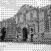
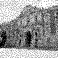
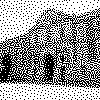

# DitherStudy-TIPE
**Framework d'expérimentation et d'analyse comparative des algorithmes de tramage numérique (dithering), explorant la transition entre quantification mathématique et modèles de perception visuelle humaine (HVS).**

---

# Étude des Algorithmes de Dithering (TIPE)

Ce projet Python explore différentes méthodes de **dithering (tramage)** pour la réduction du nombre de couleurs dans une image tout en préservant l'illusion de dégradés. Réalisé dans le cadre d'un TIPE, il compare les approches allant du simple seuillage aux modèles basés sur la vision humaine (HVS).

---

## 🚀 Fonctionnalités

Le code est structuré en chapitres thématiques pour faciliter l'étude :
* **Chapitre 1 :** Quantification simple, seuillage dynamique par histogramme et ajout de bruit (Blanc/Gaussien).
* **Chapitre 2 :** Tramage ordonné (Matrices de Bayer, Cluster, Line) et génération de **Blue Noise** via l'algorithme *Void-and-Cluster*.
* **Chapitre 3 :** Diffusion d'erreur exhaustive (Floyd-Steinberg, Atkinson, Stucki, Sierra, Jarvis-Judice-Ninke, etc.).
* **Chapitre 4 :** Dithering basé sur modèle et optimisation **Direct Binary Search (DBS)** utilisant un modèle HVS.
* **Chapitre 5 :** Benchmark automatisé (calcul de la RMSE pondérée par HVS) avec export des données vers Excel.

---

## 🖼️ Galerie de résultats

| Original (Gris) | Tramage Ordonné (Bayer) | Diffusion d'Erreur |
| :---: | :---: | :---: |
|  |  |  |


| Blue Noise (Pattern) | Direct Binary Search (DBS) |
| :---: | :---: |
|  |  |

---

## 🛠️ Installation & Utilisation

### Prérequis
* Python 3.x
* Bibliothèques : `Pillow`, `pandas`, `openpyxl`

```bash
pip install Pillow pandas openpyxl
```

### ⚙️ Configuration & Utilisation

Le script est paramétrable directement dans le code source pour s'adapter à vos propres fichiers :

1.  **Changer l'image source** : Allez à la **ligne 133** et remplacez le nom du fichier par le vôtre :
    ```python
    # Ligne 133 du fichier main.py
    lena512 = MyImage("votre_image.jpg") 
    ```
    > **Note** : Assurez-vous que l'image est dans le même répertoire que le script ou renseignez le chemin complet.

2.  **Sélectionner les chapitres à exécuter** : Modifiez la variable `sujet` en début de fichier (**ligne 11**) :
    * `sujet = []` : Exécute l'intégralité de l'étude.
    * `sujet = [3]` : Exécute uniquement la partie sur la diffusion d'erreur (Chapitre 3).
```bash
python main.py
```

---

## 📊 Méthodologie & Benchmark

Le projet intègre un outil d'évaluation de la **qualité perceptive**. Au lieu d'une simple comparaison pixel à pixel, il utilise une approche basée sur le modèle de vision humaine (**HVS**) :

* **Convolution par noyau Gaussien** : Simule la perte de détails et le lissage opéré par l'œil humain à une certaine distance.

    
* **Calcul de la RMSE** (*Root Mean Square Error*) : Mesure l'écart entre l'image originale "perçue" et l'image tramée "perçue" via la formule :
    $$\text{RMSE} = \sqrt{\frac{1}{MN} \sum_{i=1}^M \sum_{j=1}^N (I_{orig}(i,j) - I_{dith}(i,j))^2}$$

* **Export de données** : Génération automatique du fichier `Benchmark.xlsx` pour une analyse statistique approfondie des différentes méthodes.

---

## 🧬 Concepts Techniques Implémentés

* **Espace Linéaire** : Gestion rigoureuse de la luminance via une correction Gamma ($x^{2.2}$) pour éviter que les images ne paraissent trop sombres après le tramage.
* **Algorithmique Avancée** : Implémentation de parcours en **serpentin** (alternance gauche-droite / droite-gauche) pour briser les artefacts directionnels et les "traînées" caractéristiques des algorithmes de diffusion d'erreur.


* **Optimisation (DBS)** : Utilisation du *Direct Binary Search*, une méthode itérative qui échange ou bascule les pixels pour minimiser l'erreur visuelle perçue, offrant une reproduction optimale des dégradés complexes.


---
> [!NOTE]
> Ce projet a été développé dans le cadre académique des **Travaux d'Initiative Personnelle Encadrés (TIPE)**.